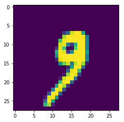
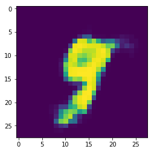

# Vanilla machine learning

This repository contains a collection of machine learning algorithm implementation in their basic form (sort of). Mostly, part of my self-studying and research. I tried to make it as concise as possible. Though I strive for major-library-free (e.g., tensorflow, keras, etc.), I might still need some part of 3rd parties such as `autograd` to compute the gradient of model parameters, as well as loss function minimization.

***

## Dependencies

- Numpy
- Autograd (`pip install autograd`)

***

## Autoencoder
A single-layer autoencoder: 1 layer for encoder, 1 layer for decoder. Usage:

```python
# Yes, I partly use keras for helper. Of course you may use the 
# other dataset as well.
(X_train, _), (X_test, _) = mnist.load_data()

X_train = X_train.astype('float32') / 255.
X_test = X_test.astype('float32') / 255.
X_train = X_train.reshape((len(X_train), np.prod(X_train.shape[1:])))
X_test = X_test.reshape((len(X_test), np.prod(X_test.shape[1:])))

enc = AutoEncoder()
enc.fit(X_train)

X_enc = enc.encode(X_test)._value
X_dec = enc.decode(X_enc)._value
plt.imshow(X_test[1000].reshape(28, 28))
plt.show()
plt.imshow(X_dec[1000].reshape(28, 28))
```

Turns out that it works pretty well.

### Original


### Reconstructed


## Neural Network
A neural network with one hidden layer.

[under development]
